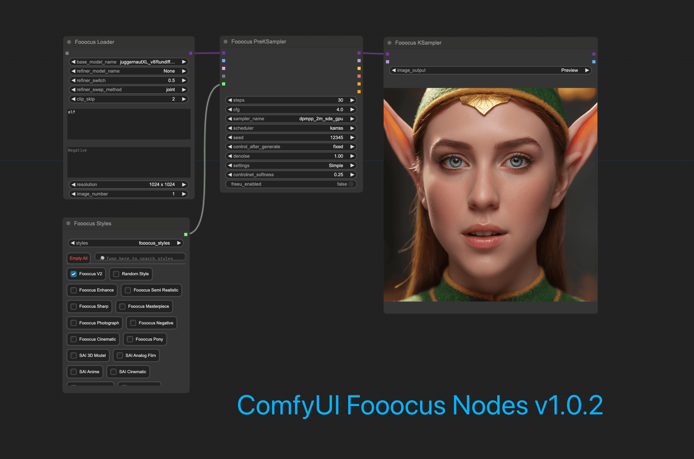
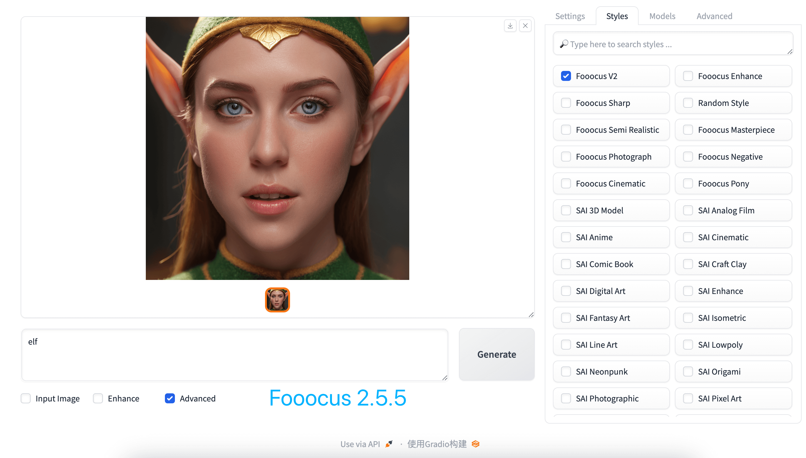

# ComfyUI Fooocus Nodes

# Installation

1. Clone the repository:
   `git clone https://github.com/Seedsa/Fooocus_Nodes.git`  
   to your ComfyUI `custom_nodes` directory

# Update

1. Navigate to the cloned repo e.g. `custom_nodes/Fooocus_Nodes`
2. `git pull`

# Comparisons

reproduce the same images generated from Fooocus on ComfyUI

# Features

- [x] Fooocus Txt2image&Img2img
- [x] Fooocus Inpaint&Outpaint
- [x] Fooocus Upscale
- [x] Fooocus ImagePrompt&FaceSwap
- [x] Fooocus Canny&CPDS
- [x] Fooocus Styles&PromptExpansion
- [x] Fooocus DeftailerFix
- [x] Fooocus Describe

# Example Workflows

[example workflows](./workflow/)

## Credits

- [Fooocus](https://github.com/lllyasviel/Fooocus)
- [ComfyUI-Easy-Use](https://github.com/yolain/ComfyUI-Easy-Use)
- [ComfyUI](https://github.com/comfyanonymous/ComfyUI)

# Acknowledgments

This project builds upon and extends the original work found at [ComfyUI_Fooocus](https://github.com/17Retoucher/ComfyUI_Fooocus).
